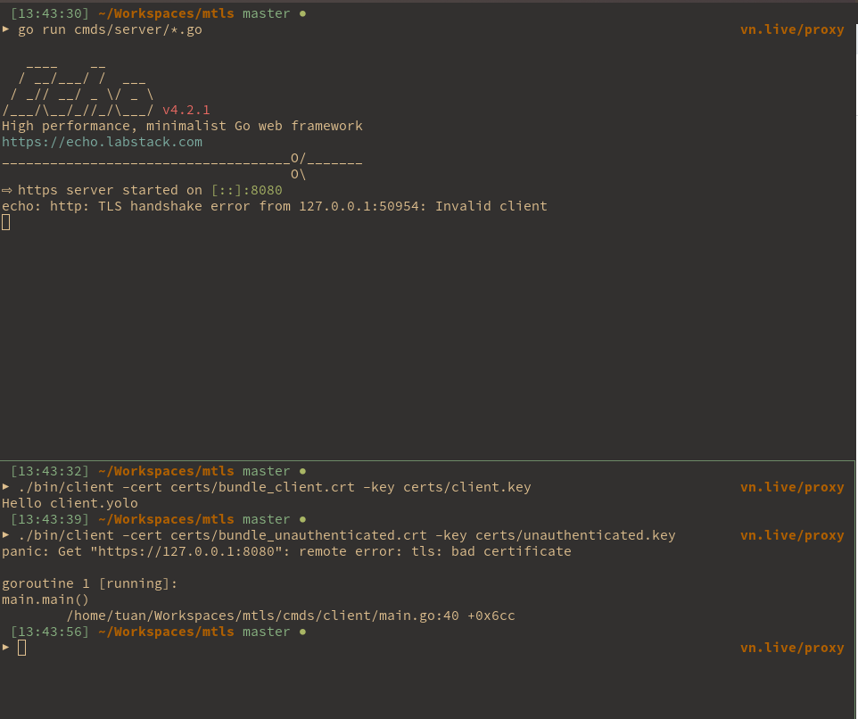

# MTLS

### Setup

```
# Gen certs
make gen_ca
make gen_intermediate
make gen_server_cert
make gen_client_cert
make gen_unauthenticated_client_cert

# Build binary
make build_server
make build_client
```

```
# Start server
./bin/server

# Execute client
./bin/client 

# Execute client with cert
./bin/client -cert certs/bundle_unauthenticated.crt -key certs/unauthenticated.key
```



### Explained

For knowledge about PKI, please read https://smallstep.com/blog/everything-pki/

mTLS is used in a zero trust environment when you need:
- Client verify that the destination server is authentic
- Server verify that the incomming client is authentic

mTLS can help which `authentication/identification` the target server and incomming client. From there, you can add your `authorization` logic whether to accept/denied

